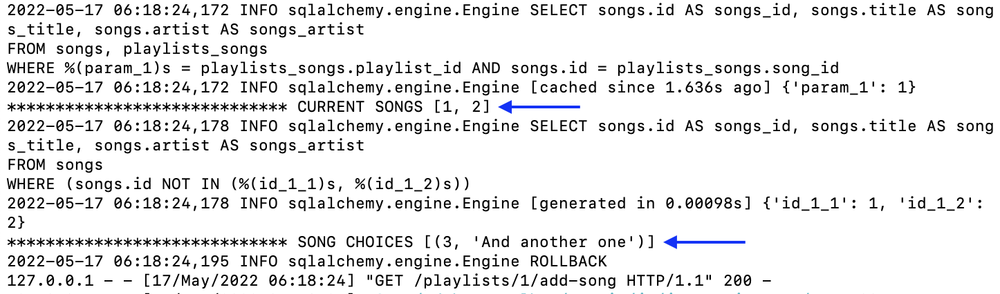
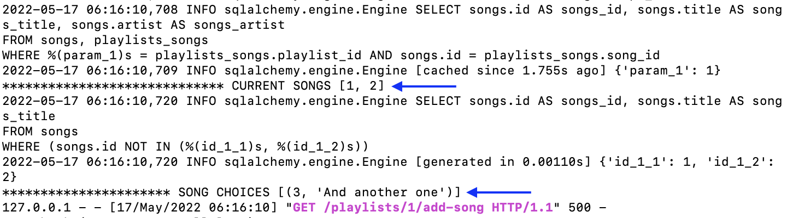
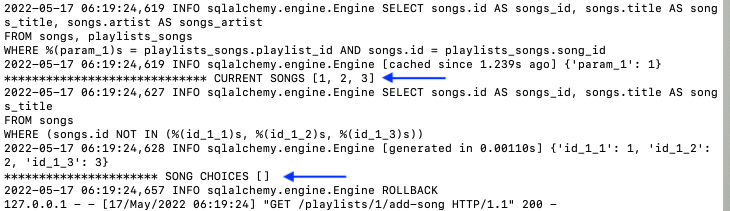
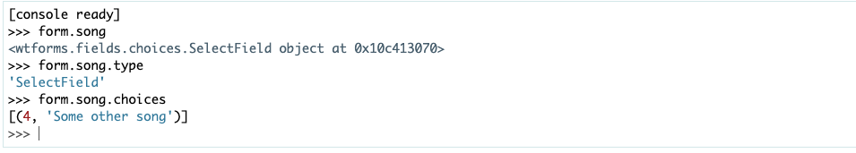
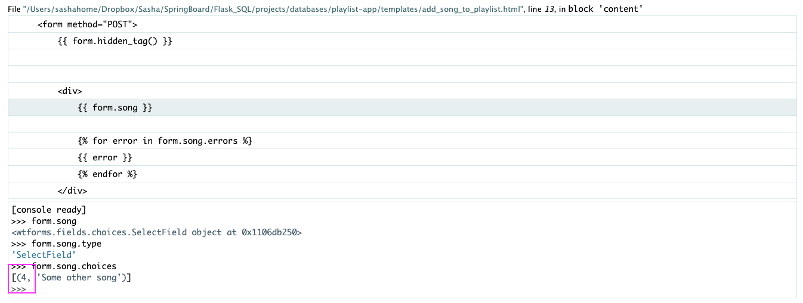
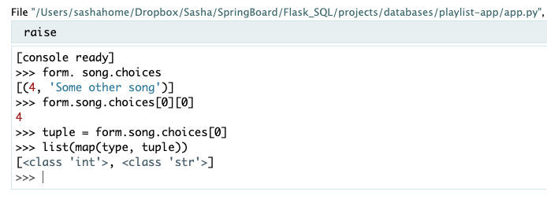
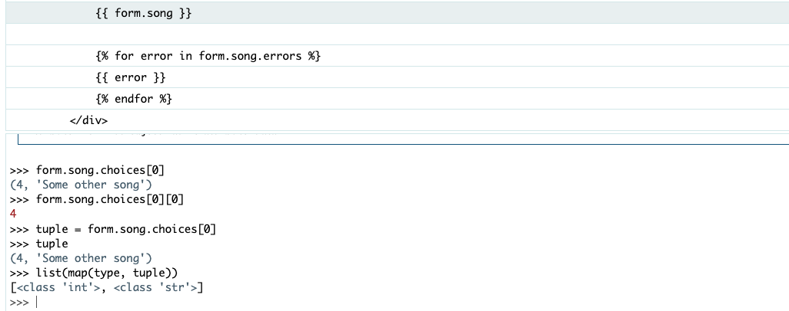

Here's the solution code pasted in the route (replacing my solution):

```python
@app.route("/playlists/<int:playlist_id>/add-song", methods=["GET", "POST"])
def add_song_to_playlist(playlist_id):
    """Add a playlist and redirect to list."""


    playlist = Playlist.query.get_or_404(playlist_id)
    form = NewSongForPlaylistForm()

    # =========================================================
    # SOLUTION
    curr_on_playlist = [s.id for s in playlist.songs]
    song_choices = (db.session.query(Song.id, Song.title)
                      .filter(Song.id.notin_(curr_on_playlist))
                      .all())

    form.song.choices = song_choices
    #That's where it dies
    # =========================================================

    if form.validate_on_submit():

          playlist_song = PlaylistSong(song_id=form.song.data, playlist_id=playlist_id)

          db.session.add(playlist_song)
          db.session.commit()

          return redirect(f"/playlists/{playlist_id}")

    return render_template("add_song_to_playlist.html",
                             playlist=playlist,
                             form=form)
```


The problem seems to be here:

```python
song_choices = (db.session.query(Song.id, Song.title)
```

------

My print statements look exactly the same for my code and the solution:

#### **Mine** 

no error



------

#### **Solution** 

error:



------

#### **Solution** 

no error when list is empty:



------

Then I played with the debugger and found this weirdness:

#### **Mine** 

when I raise an error:



The **4** in that tuple looks like its an integer, like its supposed to be

------

#### **Solution** 

when it fails to load the Select Field choices:



That doesn't look like an integer here 

------

Then I tried this on both, and now they both look like integers:

#### **Mine**:



#### **Solution**:




#### **What is happening???**

